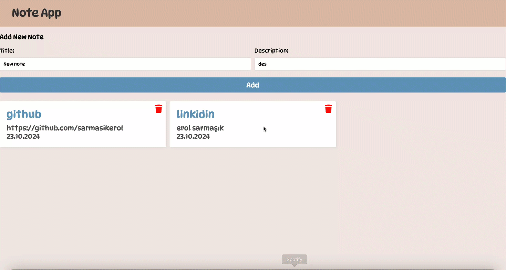

# Note Application

A simple note-taking application built with the MERN stack (MongoDB, Express.js, React, Node.js). The application supports basic CRUD (Create, Read, Update, Delete) operations for managing notes.

## Features

- **Create Notes**: Add new notes with titles and content.
- **Read Notes**: View a list of all notes.
- **Update Notes**: Edit existing notes.
- **Delete Notes**: Remove notes from the list.

## Frontend

- **Technologies**:
  - React 18
  - React Router DOM
  
- **Libraries**:
  - `react`
  - `react-dom`
  - `react-icon`
  - `react-icons`
  - `react-router-dom`
  - `react-scripts`

## Backend

- **Technologies**:
  - Express.js
  - Mongoose for MongoDB interaction
  - Nodemon for development
  
- **Libraries**:
  - `dotenv`
  - `express`
  - `mongoose`
  - `nodemon`
  
# mern-stack-notes
